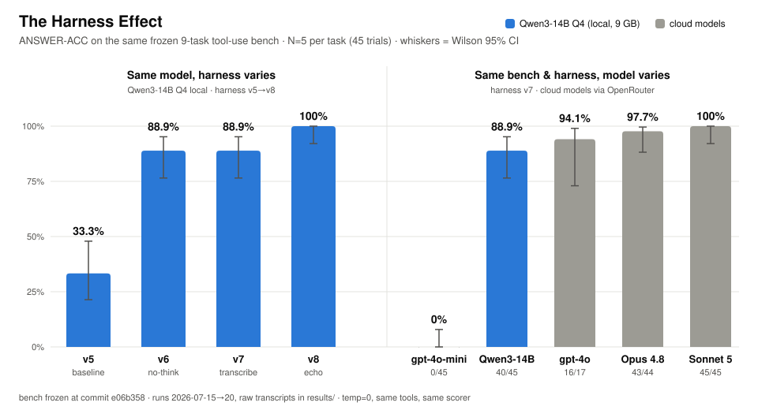
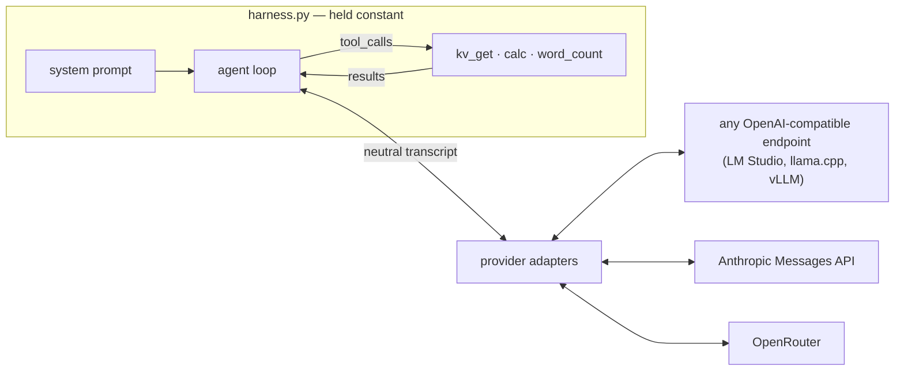

# The Harness Effect

> **Observed capability = model × harness.** Hold the harness constant to measure the model — then hold the model constant to measure the harness.

<picture>
  <source media="(prefers-color-scheme: dark)" srcset="assets/hero-dark.svg">
  
</picture>

A local **Qwen3-14B (Q4, ~9 GB)** went from **33% to 100%** on a frozen 9-task agentic tool-use benchmark. The model never changed. The tasks never changed. The scorer never changed. Every point came from the **harness** — the scaffold of prompts, loop mechanics, and tool contracts around the model. On the same bench, that puts the 14B in frontier company: gpt-4o-mini scores 0%, gpt-4o 94%, Claude Opus 4.8 98%, Claude Sonnet 5 100%.

This repo is the lab where that number was produced: a deliberately minimal, **dependency-free** (Python stdlib only) agent harness plus the benchmarks, probes, and raw run logs. It is a **research artifact, not a maintained framework** — read it, run it, steal the method.

## The headline result

Same model (Qwen3-14B Q4, temp=0), same frozen bench (9 tasks × N=5), only the harness changes:

| Harness | ANSWER-ACC | What changed |
|---|---|---|
| v5 | 15/45 = **33.3%** [CI 21–48] | baseline: thinking on, max_turns=6 |
| v6 | 40/45 = **88.9%** [CI 76–95] | thinking OFF + transcription rules + max_turns 32 + continue-nudge |
| v7 | 40/45 = **88.9%** | prompt tuning near the ceiling redistributes failures, doesn't remove them |
| v8 | 45/45 = **100%** [CI 92–100] | **echo contract** on the calc tool + max_turns 48 — system prompt untouched |

Then hold the harness fixed and swap the model (cloud columns via OpenRouter, same tasks, same scorer):

| Model | ANSWER-ACC |
|---|---|
| gpt-4o-mini | 0/45 = **0%** (replicated ×2) |
| Qwen3-14B Q4 local (harness v7) | 40/45 = **88.9%** |
| gpt-4o | 16/17 = **94%** (partial column) |
| Claude Opus 4.8 | 43/44 = **98%** |
| Claude Sonnet 5 | 45/45 = **100%** |

Every run is logged in [`results/`](results/) as JSONL with full transcripts, token usage, latency, and a manifest (model, sampling, harness file md5, git rev) — the numbers above are auditable down to individual tool calls.

## What we learned (the five lessons)

1. **`max_tokens` is a harness parameter that selectively punishes thinking models.** An apparent "+20pt harness gain" turned out to be a truncation artifact: at 1024 tokens the model's reasoning was cut *by the harness* before it could answer. Measured, admitted, corrected.
2. **Thinking mode is a superpower on short tasks and a saboteur on long chains.** With thinking on, the 14B plans everything in turn one, burns its budget, then *predicts* tool arguments instead of reading results. Thinking off + explicit transcription rules turns the transcript into working memory — externalized cognition, measured (+55pp).
3. **Tool error messages are part of the harness.** Changing `calc`'s error from "invalid expression" to an instructive one ("use only NUMBERS… retry with the numeric values") took one task from 0% to 100% at identical model and temp=0. The loop can only self-correct if the error says *how*.
4. **Near the ceiling, wording is zero-sum — mechanics win.** On a small model the prompt budget saturates: adding a rule dilutes another (whack-a-mole, measured v6→v7). The final gap closed with a *mechanical* change: `calc` returns `'62171 * 8443 = 524909753'` instead of the bare number, so the next extraction step reads a value anchored to its expression. System prompt untouched.
5. **Tool descriptions can trip frontier guardrails — deterministically.** The co-occurrence of "reads from a *database* by *key*" (kv_get) + "*evaluates an expression*" (calc) read as injection tooling to Claude Fable 5: 100% refusal, category `cyber`, on `42 + 17`. Neutral rewording dropped it to a ~20–40% stochastic residue (factorial bisection in [`probe_fable.py`](probe_fable.py) / [`probe_fix.py`](probe_fix.py), N-reps + Wilson CI). Corollary: a refusal is a **third outcome**, never a failure — capability is measured on answered runs (`ANSWER-ACC`), refusal rate reported separately.

And the meta-lesson, from the harness-ladder experiments ([`ladder.py`](ladder.py)): **the harness pays only where it touches the real failure mode — everywhere else it's a tax.** A repair loop that forces tool engagement fixed nothing on a branch-logic task (the errors weren't arithmetic); a one-line "check your work" prompt matched a 2.3×-compute verify step at 0.4× the tokens. "Loop engineering" ≠ more loop.

## Why this comparison is honest

- **Frozen bench**: tasks + strict scorer frozen at commit [`e06b358`](../../commit/e06b358) *after* the baseline, before any harness improvement. File md5s are recorded in every run manifest.
- **Strict scoring**: exact numeric match on a final `RISPOSTA: <n>` line — no credit for intermediate numbers appearing in the transcript.
- **N repetitions + Wilson 95% CI** on everything; overlapping CIs are called noise, not ranking.
- **ERROR ≠ FAIL**: timeouts and 429s don't count against the model. Timeouts are never retried (at temp=0 a retry is the same call — it just triples the bill).
- **Declared confounds**: native tool-call formats differ per provider (each model plays "at home" — fair, not byte-identical); Anthropic models reject `temperature` and always think (asymmetry declared, not hidden); the local model is a Q4 quantization — you're benchmarking *that build*; thinking regimes are never mixed within a run.

The architecture that makes the swap clean — one loop, neutral transcript, thin per-provider adapters:



## Quickstart

Zero dependencies — Python 3.10+ stdlib only.

```bash
git clone https://github.com/Rebis-Labs/the-harness-effect && cd the-harness-effect

# serve any OpenAI-compatible model locally (default: LM Studio at localhost:1234)
python3 bench.py                                # easy suite, local model
python3 bench_hard.py -n 5 --thinking off       # the frozen hard suite
python3 ladder.py --canary                      # harness-ladder smoke test

# cloud columns (needs OPENROUTER_API_KEY)
python3 bench_frontier.py --model anthropic/claude-sonnet-5 --only err_fallback -n 1   # canary first
python3 bench_frontier.py --model anthropic/claude-sonnet-5 -n 5

# inspect any run
python3 diagnose_hard.py results/20260720T134533.jsonl
```

## Repo map

| File | What |
|---|---|
| [`harness.py`](harness.py) | The object of study: tools, provider adapters, the agent loop, prompts. Heavily commented — every odd-looking line has its experiment. |
| [`bench.py`](bench.py) | Easy 5-task suite + shared scorer/CI utilities |
| [`bench_hard.py`](bench_hard.py) | The frozen 9-task hard suite (the headline numbers) |
| [`bench_frontier.py`](bench_frontier.py) | Cloud model columns via OpenRouter, same harness |
| [`bench_hard2.py`](bench_hard2.py) | **Open problem** — next-generation tasks, NOT yet frozen (see below) |
| [`ladder.py`](ladder.py) + [`tasks_ledger.py`](tasks_ledger.py) | Fixed model, *variable* harness: rungs h0→h4 vs compute-matched null controls |
| [`probe_fable.py`](probe_fable.py) / [`probe_fix.py`](probe_fix.py) | Reproducible bisection of the tool-description guardrail trigger |
| [`results/`](results/) | Raw JSONL for every run: manifests, transcripts, usage, timing |
| [`README.it.md`](README.it.md) | The full lab log (Italian) — day-by-day results, dead ends included |

## Open problem: `bench_hard2`

The frozen bench is now saturated at the top (local 100%, frontier 94–100%): it discriminates *below* (harness quality, small models) but no longer *above*. `bench_hard2.py` is the unfrozen attempt to fix that — 12–18-stage chains, interleaved state, answers auto-computed by simulation. Qualification gate: a task counts only if a reference frontier model drops below 80% at N≥5. Current status: the local 14B fails one task (80%), Sonnet solves it — the bench measures the local↔frontier gap but probably not frontier↔frontier yet. Ideas that break "last-echo" crutches (back-references to earlier stages, three interleaved chains) are welcome.

## Citation

If this benchmark or methodology is useful to your work, cite it (see [`CITATION.cff`](CITATION.cff)):

> Esposito Brescia, A. (2026). *The Harness Effect: measuring how much of LLM capability is the scaffold.* Rebis Labs. https://github.com/Rebis-Labs/the-harness-effect

## License

[MIT](LICENSE). Developed as an internal lab at [Rebis Labs](https://rebislabs.com) — commit history (in Italian) is the original lab notebook, published unedited for auditability.
